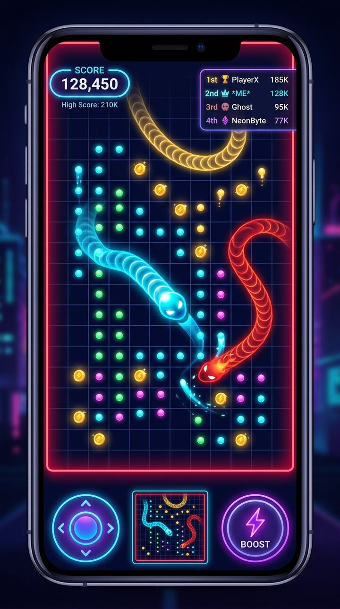

# 🐍 Snake Royale

A fast, neon **battle-royale snake game** for Android, written in plain **HTML5 + CSS3 + JavaScript** and packaged as a native app with **Capacitor** (or Cordova, or a bare WebView).

Slither around a huge arena, eat glowing energy dots, collect coins, and survive 5–10 AI vipers that hunt, flee and actively try to cut you off. One touch of another snake — or the wall — and you explode into food for everyone else.


<sub>Concept art — the real game is rendered live on an HTML5 canvas.</sub>

> **No build step, no framework, no bundler.** The files in `www/` *are* the app. Open `index.html` in a browser and you are playing.

---

## Table of contents

1. [Features](#features)
2. [Quick start](#quick-start)
3. [Project structure](#project-structure)
4. [How to play](#how-to-play)
5. [Architecture](#architecture)
6. [Configuration](#configuration)
7. [Monetization (AdMob)](#monetization-admob)
8. [Progression & local storage](#progression--local-storage)
9. [Building the Android APK](#building-the-android-apk)
   - [Option A — Capacitor (recommended)](#option-a--capacitor-recommended)
   - [Option B — Cordova / PhoneGap](#option-b--cordova--phonegap)
   - [Option C — Bare WebView in Android Studio](#option-c--bare-webview-in-android-studio)
   - [Signing, icons & release](#signing-icons--release)
10. [Performance notes](#performance-notes)
11. [Testing](#testing)
12. [Customization recipes](#customization-recipes)
13. [Troubleshooting](#troubleshooting)
14. [License](#license)

---

## Features

### Gameplay
- **Modern slither movement** — continuous, physics-based body chain instead of chunky grid steps.
- **Wrap-around *or* bounded arena** — the default is a large bounded arena with lethal neon walls (`CONFIG.world.wrap`).
- **Permadeath** — touching another snake's body, another snake's head (if you are the smaller one) or the arena wall kills you instantly and your corpse explodes into collectible energy dots.
- **Boost** — burn your own mass for speed and leave a trail of food behind you.

### Controls (built for touch)
- **Virtual joystick** — fixed pad (bottom-left) with a knob that follows your thumb, plus a *dynamic base* so you can keep steering without lifting your finger.
- **Swipe / drag anywhere** — a floating pad appears exactly where you touch.
- **Both** — fixed pad when you grab it, floating pad everywhere else.
- **Boost button** (bottom-right), keyboard support (arrows / WASD / Space / Esc) for desktop testing, `~0` allocation input handling, `touch-action: none` to kill double-tap zoom and pull-to-refresh.

### AI bots
- **5–10 enemy snakes** with random sizes, names and six distinct **personalities** (`hunter`, `grazer`, `brawler`, `trickster`, `rookie`, `titan`).
- Each bot runs a **sense → think → act** cycle:
  - a per-frame *whisker* reflex that dodges walls and bodies instantly,
  - a 5–20 Hz *think* tick that scores ~13 candidate headings for wall danger, body danger, food value and prey value,
  - behaviours: **GRAZE** (forage), **HUNT** (intercept where you *will* be), **TRAP** (cut across your path), **FLEE** (run from bigger snakes).
- Bots boost to escape, to close a kill, or to sprint to distant food — and they get bigger the longer a round lasts.

### Monetization (AdMob ready)
- Modern **Game Over** screen with score, best, length, kills, coins earned and a **“Revive — Watch Ad”** button.
- **Rewarded video** placeholder that plays a simulated 30-second ad and revives you **at the same spot with your score preserved** (once per run).
- **Interstitial** placeholders wired between rounds, with a frequency cap.
- Real plugin auto-detection (`@capacitor-community/admob`, `cordova-plugin-admob-free`); falls back to the simulator when no plugin is present, so the whole flow is testable without an AdMob account.

### Progression
- **localStorage** persistence of high score, coins, unlocked/selected skins, settings and lifetime statistics.
- **Skins Shop** with five skins (3 core: *Neon Blue*, *Glowing Red*, *Golden Viper* + *Plasma Purple*, *Toxic Green*), live canvas previews, buy / equip / equipped states.
- Coins are collected on the map **and** awarded from your final score.

---

## Quick start

### Play it right now (no install)

```bash
npm run serve          # http://localhost:8080
```

Or simply open `www/index.html` in a desktop browser (keyboard: arrows + Space).

### Run the tests

```bash
npm test                       # head-less simulation test (no dependencies)
npm i -D jsdom && node tools/dom-test.js   # full UI wiring test in jsdom
```

---

## Project structure

```
snake-royale/
├── README.md                  # this file
├── LICENSE
├── package.json               # convenience scripts (serve / test / capacitor)
├── capacitor.config.json      # Capacitor: appId, webDir = www, splash screen
├── config.xml                 # Cordova / PhoneGap project descriptor
│
├── www/                       # ← the entire app (this is what gets packaged)
│   ├── index.html             # screens markup + script loading order
│   ├── manifest.webmanifest   # PWA metadata
│   ├── assets/
│   │   └── icon.svg
│   ├── css/
│   │   ├── main.css           # design tokens, reset, buttons, panels, toast
│   │   ├── hud.css            # HUD, minimap, leaderboard, joystick, boost btn
│   │   ├── screens.css        # loading, menu, pause, game over, ad player
│   │   └── shop.css           # skins shop cards
│   └── js/
│       ├── main.js            # bootstrap: creates modules, binds DOM + lifecycle
│       ├── core/
│       │   ├── config.js      # EVERY tunable number lives here
│       │   ├── utils.js       # math, random, colour and timing helpers
│       │   ├── events.js      # tiny pub/sub used to decouple modules
│       │   └── storage.js     # localStorage profile (score, coins, skins…)
│       ├── data/
│       │   ├── skins.js       # skin catalogue (add a skin = add one object)
│       │   └── botNames.js    # bot names + AI personality archetypes
│       ├── entities/
│       │   ├── snake.js       # movement, growth, boost, death, snapshot/restore
│       │   ├── food.js        # energy dots & coins
│       │   └── particles.js   # pooled particle system
│       ├── world/
│       │   ├── world.js       # arena, spawns, collectibles, death drops
│       │   └── spatialHash.js # uniform grid for broad-phase queries
│       ├── ai/
│       │   └── botBrain.js    # the enemy AI (sense / think / act)
│       ├── input/
│       │   └── inputManager.js# joystick + swipe + boost + keyboard
│       ├── render/
│       │   ├── camera.js      # follow camera, size-aware zoom, screen shake
│       │   ├── sprites.js     # pre-rendered glow/dot/coin sprites + previews
│       │   └── renderer.js    # canvas drawing, culling, adaptive quality
│       ├── ads/
│       │   └── adManager.js   # AdMob bridge + simulated ad player
│       ├── audio/
│       │   └── sfx.js         # WebAudio sound effects (no audio files)
│       ├── ui/
│       │   ├── screens.js     # screen state machine + toasts
│       │   ├── hud.js         # score/length/coins, minimap, leaderboard
│       │   └── shop.js        # skins shop
│       └── game/
│           └── game.js        # state machine, rules, collisions, round flow
│
├── native/android-webview/    # optional bare-WebView Android Studio template
│   ├── README.md
│   ├── MainActivity.java
│   ├── activity_main.xml
│   ├── AndroidManifest.xml
│   ├── build.gradle
│   └── themes.xml
│
└── tools/
    ├── serve.js               # dependency-free static dev server
    ├── smoke-test.js          # head-less simulation test (npm test)
    └── dom-test.js            # jsdom UI test (optional)
```

---

## How to play

| Action | Touch | Desktop |
| --- | --- | --- |
| Steer | Drag the joystick, or swipe anywhere | Arrows / WASD |
| Boost | Hold **BOOST** | Space |
| Pause | ⏸ button (top right) | Esc |

- **Eat** glowing dots to grow. Big snakes turn wider, so growth is a trade-off.
- **Coins** (golden) are permanent currency for the Skins Shop.
- **Crash** into any body or wall and you die — but your corpse feeds everyone.
- **Trap** bigger bots: circle tightly and let them fly into your body. You get a **+50** score bonus per elimination.
- **Revive** once per run with a rewarded video — you come back where you died, score intact, with a 3-second shield.

---

## Architecture

### Design rules

1. **One global namespace** (`window.SR`) with classic `<script>` tags — no ES modules, so the game also works from `file://` inside a WebView. Load order in `index.html` *is* the dependency graph (core → data → entities → world → ai → input → render → ads → audio → ui → game → main).
2. **No DOM access at load time** — modules only touch the DOM inside methods. That is why the simulation can be unit-tested in Node (`tools/smoke-test.js`).
3. **Fixed timestep simulation, variable rendering** — `CONFIG.game.fixedStep` (1/60 s) with an accumulator, so the physics and the AI are frame-rate independent.
4. **Data-oriented entities** — food and body joints are plain objects, pooled particles, reused typed arrays for screen-space paths.
5. **Decoupled UI** — the game emits events (`SR.Events`) and calls `SR.Hud` / `SR.Screens` / `SR.Sfx` / `SR.AdManager`; it never queries the DOM for state.

### Frame flow

```
requestAnimationFrame
   └─ Game._loop(ts)
        ├─ dt = clamp(ts - lastTs)
        ├─ while (accumulator >= fixedStep) Game.step(fixedStep)
        │      ├─ world.rebuildSnakeHash()
        │      ├─ input → player.setDirection()/boosting
        │      ├─ bot.brain.update()            (sense → think → act)
        │      ├─ snake.update()                (steer → move → body chain)
        │      ├─ boost drain → tail food
        │      ├─ rules: walls, bodies, head-on, pickups
        │      └─ world.update() + bot respawns
        └─ Game.render(dt)
               ├─ camera.follow(player)
               ├─ Renderer.render()  (cull → grid → border → food → snakes → FX)
               └─ Hud.update()       (throttled + minimap/leaderboard)
```

### Collision model

- Every body joint is bucketed into a `SpatialHash` once per step.
- A head dies when `dist(head, joint) < headR*0.72 + jointR*0.82`.
- Head-to-head: the shorter snake dies; if lengths are within 10 %, both die.
- Walls: lethal (`CONFIG.world.wrap = false`) — a *shielded* snake is pushed back inside and turned towards the centre instead of dying.

---

## Configuration

`www/js/core/config.js` is the single source of truth. The knobs you will most likely touch:

| Key | Default | Meaning |
| --- | --- | --- |
| `world.width` / `height` | `3800` | Arena size in world units |
| `world.wrap` | `false` | `true` = wrap-around, `false` = lethal walls |
| `world.foodTarget` | `420` | Energy dots kept on the map |
| `world.coinTarget` | `22` | Coins kept on the map |
| `game.botCount` | `7` | AI snakes (spec range 5–10; clamped by `minBots`/`maxBots`) |
| `game.startLength` | `16` | Player starting joints |
| `game.botStartLengthMin/Max` | `12` / `60` | “various sizes” of the bots |
| `game.killBonus` | `50` | Score for eliminating a snake |
| `game.coinsPerScore` | `1/25` | End-of-run coin bonus |
| `snake.baseSpeed` | `178` | World units / second |
| `snake.boostMultiplier` | `1.85` | Speed while boosting |
| `snake.boostDrain` | `2.4` | Joints burned per second of boost |
| `snake.turnRate` | `3.9` | rad/s (falls off as you grow) |
| `camera.minZoom` / `maxZoom` | `0.45` / `1.1` | Zoom-out range |
| `render.maxDPR` | `2` | Device-pixel-ratio cap |
| `ads.rewardedDurationSec` | `30` | Length of the *simulated* rewarded video |
| `ads.interstitialCooldownSec` | `90` | Minimum gap between interstitials |

---

## Monetization (AdMob)

All ad code lives in **`www/js/ads/adManager.js`**. The rest of the game only ever calls:

```js
SR.AdManager.showRewarded({ onReward, onClose, onFail });
SR.AdManager.showInterstitial({ onClose });
SR.AdManager.preload();
```

### 1. Out of the box (placeholder mode)

With no plugin installed, `AdManager` detects nothing and uses its **built-in simulated ad player**:

- Rewarded: a full-screen 30-second fake video with countdown, progress bar and a close button that only appears at the end. Closing early **forfeits the reward** — exactly like a real ad.
- Interstitial: a short simulated full-screen between rounds, gated by `ads.interstitialCooldownSec`.
- Both fire the same callbacks, so **the entire monetization flow is testable end-to-end before you have an AdMob account**.

### 2. Going live with Capacitor

```bash
npm i @capacitor-community/admob
npx cap sync android
```

Then put your **real** ad unit ids in `www/js/core/config.js`:

```js
ads: {
  enabled: true,
  testMode: false,                 // ← set false for production
  adUnits: {
    android: {
      appId:       'ca-app-pub-XXXXXXXXXXXXXXXX~YYYYYYYYYY',
      rewarded:    'ca-app-pub-XXXXXXXXXXXXXXXX/ZZZZZZZZZZ',
      interstitial:'ca-app-pub-XXXXXXXXXXXXXXXX/WWWWWWWWWW'
    }
  }
}
```

And add the app id to `android/app/src/main/AndroidManifest.xml` (the Capacitor plugin documents this):

```xml
<meta-data
    android:name="com.google.android.gms.ads.APPLICATION_ID"
    android:value="ca-app-pub-XXXXXXXXXXXXXXXX~YYYYYYYYYY" />
```

`AdManager` calls `initialize()` / `prepareRewardVideoAd()` / `showRewardVideoAd()` (Capacitor) or `rewardvideo.load()` / `show()` (Cordova) automatically. If anything throws, it **falls back to the simulator**, so a broken plugin degrades gracefully instead of crashing the game.

### 3. Where ads are triggered

| Moment | Format | Code |
| --- | --- | --- |
| Game Over → “Revive” button | Rewarded | `Game.requestRevive()` → grants `Game.revivePlayer()` |
| “Play again” / “Main menu” | Interstitial | `Game.playAgain()` / `Game.quitToMenu()` |
| App start | Preload | `SR.AdManager.preload()` in `main.js` |

Compliance reminders: never auto-close a rewarded video, always grant the reward **after** `onRewarded`, and do not show interstitials during gameplay. The placeholder follows all three rules.

---

## Progression & local storage

`www/js/core/storage.js` keeps one versioned JSON blob under `snakeRoyale.v1.profile`:

```json
{
  "version": 1,
  "bestScore": 0,
  "bestLength": 0,
  "coins": 0,
  "selectedSkin": "neon-blue",
  "unlockedSkins": ["neon-blue"],
  "stats":  { "games": 0, "kills": 0, "foodEaten": 0, "coinsCollected": 0, "totalScore": 0, "revives": 0 },
  "settings": { "controls": "joystick", "sound": true, "effects": true, "grid": true }
}
```

- Writes are wrapped in `try/catch`; if `localStorage` is unavailable (Safari private mode, hardened WebView) the game silently falls back to an in-memory store and still plays.
- Coins: **1–3 per coin pickup** on the map + `floor(score / 25)` at the end of every run.
- Skins: `neon-blue` is free; `glowing-red` 150, `golden-viper` 400, `plasma-purple` 800, `toxic-green` 1200.
- Settings are mirrored onto the live `SR.CONFIG` so every module reads one source of truth.
- “RESET PROGRESS” in the Settings screen wipes the profile.

---

## Building the Android APK

### Prerequisites (all options)

- **Android Studio** Hedgehog (2023.1) or newer
- **JDK 17** (bundled with modern Android Studio)
- **Android SDK** with *Android SDK Platform 34* and *Build-Tools 34.x*
  (`Settings → Android SDK → SDK Platforms`)
- **Node.js 18+** (for Capacitor/Cordova)

### Option A — Capacitor (recommended)

Capacitor copies `www/` into a real Android project and gives you plugins (AdMob, splash screen).

```bash
cd snake-royale
npm install                          # installs @capacitor/cli + @capacitor/core

# 1. create the config (already in the repo, this is the equivalent command)
npx cap init "Snake Royale" com.snakeroyale.app --web-dir=www

# 2. add the Android platform (creates ./android)
npm i @capacitor/android
npx cap add android

# 3. copy the web assets into the native project - repeat after EVERY change
npx cap sync android            #   (npm run cap:sync)

# 4. open Android Studio
npx cap open android            #   (npm run cap:android)
```

In Android Studio:

1. Wait for **Gradle sync** to finish (first sync downloads the SDK deps — it can take several minutes).
2. Connect a device (USB debugging on) or start an emulator.
3. Press **Run ▶**. You should see the Snake Royale menu.
4. **Build → Build Bundle(s) / APK(s) → Build APK(s)** for a debug APK at
   `android/app/build/outputs/apk/debug/app-debug.apk`.

**Iterating:** after editing anything in `www/`, run `npx cap sync android` and press Run again. Use **Chrome DevTools → `chrome://inspect`** to debug the live WebView.

**Live reload on device (optional):** point `server.url` at your machine in `capacitor.config.json`, then `npx cap sync`:

```json
"server": { "url": "http://192.168.1.42:8080", "cleartext": true }
```

### Option B — Cordova / PhoneGap

`config.xml` is already in the repo and expects the web assets in `www/`.

```bash
npm i -g cordova
cordova platform add android
cordova plugin add cordova-plugin-admob-free --save \
  --variable ADMOB_APP_ID=ca-app-pub-XXXXXXXXXXXXXXXX~YYYYYYYYYY
cordova build android            # APK in platforms/android/app/build/outputs/apk/
cordova run android              # install on a connected device
```

Open the generated `platforms/android` folder with **Android Studio → Open an Existing Project** when you want the IDE.

### Option C — Bare WebView in Android Studio

No JavaScript tooling at all — see [`native/android-webview/`](native/android-webview/README.md).

```bash
# 1. Android Studio → New Project → Empty Views Activity (Java, minSdk 22)
# 2. copy the game into the assets folder
mkdir -p app/src/main/assets
cp -r www app/src/main/assets/www
# 3. copy the template files over the generated ones
cp native/android-webview/MainActivity.java  app/src/main/java/com/snakeroyale/app/
cp native/android-webview/activity_main.xml  app/src/main/res/layout/
cp native/android-webview/AndroidManifest.xml app/src/main/
cp native/android-webview/themes.xml         app/src/main/res/values/
# 4. merge native/android-webview/build.gradle into app/build.gradle
# 5. Run ▶
```

### Signing, icons & release

1. **Icons & splash** — Android Studio: right-click `app/res` → *New → Image Asset*; or replace `android/app/src/main/res/mipmap-*/ic_launcher.png`. A ready-made vector logo is in `www/assets/icon.svg`.
2. **Change the app id** — `capacitor.config.json` (`appId`), then `npx cap sync android`. In Android Studio: *Refactor → Rename* the package, or set `applicationId` in `app/build.gradle`.
3. **Version** — `versionCode` / `versionName` in `android/app/build.gradle` (Capacitor) — bump `versionCode` for every upload to Google Play.
4. **Release build** — *Build → Generate Signed Bundle / APK* → create a keystore (**keep the `.jks` file and passwords safe: losing them means you can never update the app**) → choose **Android App Bundle (.aab)** for Google Play, or **APK** for direct distribution.
5. **Google Play** requires an `.aab`, target API 34+, and the AdMob app id present in the manifest.

---

## Performance notes

The game is designed for 60 fps on low-end Android:

- **No `shadowBlur`** — glows are pre-rendered once into small off-screen canvases (`render/sprites.js`) and blitted with `drawImage`.
- **DPR capped at 2** (and forced to 1 on very large surfaces) — `render.maxDPR`.
- **Aggressive culling** — food is fetched from the spatial hash per visible rect; snakes are skipped when their bounding box is off-screen.
- **Chunked tapering** — the body is stroked in 8-joint chunks (~25 strokes for a long snake) instead of one stroke per joint.
- **Pooled particles** — zero allocation after warm-up, hard cap at `render.maxParticles`.
- **Adaptive quality** — if the average fps drops below `render.lowFpsThreshold` (45) the glow pass is disabled automatically and re-enabled above 55.
- **Throttled DOM** — the HUD only writes when a value changes; the minimap redraws at ~15 Hz and the leaderboard at 2.5 Hz.
- **Fixed timestep with a 6-step catch-up guard** — a long GC pause can never trigger a death spiral.

Measured with `npm test`: **~0.25 ms per simulation step** with 12 snakes / ~1000 body joints (budget: 16 ms).

---

## Testing

```bash
npm test                                        # 65 checks - simulation (no deps)
npm run test:render                             # 14 checks - canvas renderer (no deps)
npm i -D jsdom && npm run test:dom              # 53 checks - real index.html in jsdom
npm run test:all                                # everything
```

| Tool | Covers |
| --- | --- |
| `tools/smoke-test.js` | head-less simulation: utils, spatial hash, storage/economy, snake physics, a full 90-second round, permadeath rules, pickups, revive, ad contract, performance budget |
| `tools/render-test.js` | runs the real renderer against a recording Canvas2D mock: 15 s of play, boost/explosion/shield FX, extreme snake sizes, wrap-around mode, rotation — and asserts **no NaN ever reaches the canvas** |
| `tools/dom-test.js` | boots the real `index.html` in jsdom: every element id used by JS exists, navigation, settings, shop purchases, gameplay, pause, game over, rewarded-revive flow |

They are plain Node scripts with coloured output and a non-zero exit code on failure, so they drop straight into CI:

```yaml
- run: npm test
- run: npm run test:render
```

---

## Customization recipes

**Add a skin** — append one object to `SR.SKINS` in `www/js/data/skins.js`. The shop card, preview and in-game renderer pick it up automatically.

```js
{
  id: 'shadow', name: 'Shadow', price: 1500,
  desc: 'Silent, dark, deadly.',
  core: '#9aa7c7', edge: '#151a2e', glow: '#6f7dff',
  eye: '#000000', pattern: 'pulse'      // solid | stripe | pulse | flame
}
```

**More mayhem** — `CONFIG.game.botCount: 10`, `CONFIG.game.botStartLengthMax: 90`.

**Bigger arena / wrap-around** — `CONFIG.world.width/height: 5000` and `CONFIG.world.wrap: true` (walls stop killing and snakes teleport across the seam).

**Easier early game** — `game.botStartLengthMax: 35`, `snake.startInvuln: 3`.

**Longer/shorter ads** — `ads.rewardedDurationSec` (the simulator only; real ads use the network) and `ads.interstitialCooldownSec`.

**Disable ads entirely** — `ads.enabled: false` (the UI hides the revive button automatically).

**New AI personality** — add an entry to `SR.BOT_PERSONALITIES` in `www/js/data/botNames.js` with `aggression`, `greed`, `caution`, `skill` (all 0–1).

---

## Troubleshooting

| Symptom | Fix |
| --- | --- |
| Black screen after packaging | Make sure the assets were copied: `npx cap sync android`. With the bare WebView, check `app/src/main/assets/www/index.html` exists. |
| `net::ERR_FILE_NOT_FOUND` | You opened `index.html` directly from the file system and the browser blocked relative script loads — use `npm run serve` or package it properly. |
| Progress is not saved | `setDomStorageEnabled(true)` in the WebView settings (the template already does this), and don't use private browsing. |
| Everything is blurry on a tablet | Lower `render.maxDPR` to `1`. |
| Stuttering on an old phone | Set `render.glow`/`render.particles` to `false` in the in-game Settings (or `CONFIG.render`). |
| AdMob crashes on start | The `com.google.android.gms.ads.APPLICATION_ID` meta-data is missing or is still the sample id while `testMode` is `false`. |
| “Ad not ready” on the revive button | The simulator marks the ad ready ~1 s after boot; in production, wait for `preload()` to resolve. |
| Touch controls feel inverted | You are running an old WebView: update Android System WebView from the Play Store. |
| `npx cap` says “Android platform not found” | Run `npm i @capacitor/android && npx cap add android` first. |

---

## License

MIT — see [LICENSE](LICENSE). Use it, ship it, reskin it.

The ad unit ids committed in `config.js` are **Google's official sample ids** — replace them with your own before publishing.
